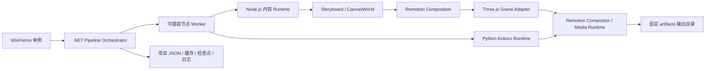

# MotionVideoPipeline 产品需求文档

版本：0.1.0（新项目立项稿）  
日期：2026-10-08（Asia/Shanghai）  
产品形态：Windows 单机 WinForms 应用  
项目名称：MotionVideoPipeline

实施目标仓库：<https://github.com/ShiZeHan45/MotionUtil>  
实施分支：`f_rebuild`（本 PRD 只记录目标位置；是否将新项目推送到该远程仓库需在工程初始化时确认）

## 1. 产品定义

MotionVideoPipeline 是一个面向视频自媒体创作者的本地视频内容生产流水线。默认模式下，用户只需设置榜单来源、批量数量 N、过滤条件、音色和输出策略；系统自动拉取周推荐项目，完成资料发现、事实核验、演讲稿、钩子、配音、背景音乐、连续画布动画、字幕、质量检查和 MP4 导出。用户也可以提供单个主题或草稿作为可选输入，但这不是自动批量主流程的前置条件。

首个垂直场景是 GitHub 开源项目、开源 Skill 和开源 AI 应用的讲解视频；产品从第一天开始使用“领域包”抽象，后续可扩展到育儿、时事、常识、教育和产品评测。每个领域包只负责资料采集规则、事实字段、表达风格和模板参数，流水线核心不因领域变化而重写。

本 PRD 对应一个全新项目。它不复用旧项目的业务代码、旧输出目录或旧发布物；旧仓库只能作为用户提供的背景链接，不作为本项目实现依赖。

## 2. 产品目标与边界

### 2.1 目标

1. 让用户在 WinForms 中配置周榜批量任务，一键自动创建 N 条讲解视频，并能看见每个项目和每个节点的状态、进度、输入和输出。GitHub 周榜主源固定为 `https://github.com/trending?since=weekly`。
2. 让 AI 自动发现项目、采集可追溯资料、整理事实、生成固定时间线骨架、演讲稿和钩子；默认流程不要求用户逐条提供主题、演讲稿、钩子或资料。
3. 使用 Kokoro 生成中文配音，按实际音频时长驱动字幕和动画，加入可配置且可试听的音色。
4. 使用 Remotion 编排视频帧，使用 Three.js 构建连续无边画布上的图形、空间关系、镜头和动态背景。
5. 通过稳定的节点契约实现插拔替换：资料源、模型、脚本器、音色、音乐策略、视觉主题和导出器都可以独立替换；音色目录的预热和缓存由统一的 `VoiceCatalogPreloader` 管理，禁止试听时懒加载。
6. 输出适合手机竖屏观看的成片，单条不超过 5 分钟，字幕、声音和动画顺序一致；批量任务中单个项目失败不能阻断其他项目。
7. 领域包由系统提供 GitHub 默认包；新增领域可由 AI 根据领域描述自动生成、校验和安装，不要求用户手工编写目录或提示词。

### 2.2 不做什么

- 第一阶段不自动登录、发布或运营抖音、视频号、B 站等平台。
- 不把静态“卡片 + 大段文字”作为默认视频表达；信息必须通过连续绘制、镜头推进、关系变化或真实操作演示呈现。
- 不默认使用文生图、图生视频或无法追溯的项目资料作为事实证据。
- 不把模型服务、Kokoro 或外部资料源写死在业务节点中。
- 不把“人工逐条选题、人工整理资料、人工写稿、人工逐条确认”作为默认批量流程的必要步骤；异常项目进入隔离队列并自动继续其他项目。
- 不支持同一安装实例并行启动多个桌面主进程；渲染队列在单进程内串行，未来再评估多进程并行。

## 3. 用户与核心场景

### 3.1 用户

- 内容创作者：关心选题、脚本质量、钩子、节奏、成片预览和批量产出。
- 内容编辑：关心事实来源、字幕、段落、案例顺序和可人工修改性。
- 流程维护者：关心节点替换、失败重试、日志、缓存和环境健康度。

### 3.2 主流程：周榜自动批量模式

默认主流程必须在没有逐条人工干预的情况下完成。用户只在任务开始前设置一次批量参数；任务运行中不要求人工点击“批准”才能继续。

1. 用户打开“周榜批量任务”，设置 `batchCount=N`、榜单周期（默认最近一周）、领域包（默认 GitHub Open Source）、语言过滤、最低 Star、排除已生成项目、音色、BGM 策略和输出目录。榜单主源不可编辑，固定为 `https://github.com/trending?since=weekly`；用户只能配置备用源和筛选条件。
2. `WeeklyRankingCollector` 自动读取固定的 GitHub Weekly Trending URL `https://github.com/trending?since=weekly`；通过来源适配器获取排名、仓库地址、官方名称、编程语言、周增长指标和抓取时间。主源不可用时，按配置的备用源顺序重试，不允许静默使用过期榜单；快照必须记录实际使用的 URL 和抓取时间。
3. `CandidateSelector` 按排名从高到低选择 N 个候选，去除黑名单、重复仓库、已成功生成且仍在冷却期的项目；不足 N 个时显示不足原因并按策略选择“少于 N 继续”或“任务失败”，不得伪造项目。
4. 每个候选自动创建独立 `ProjectRun`，生成稳定的 `projectId`、输入快照和缓存键；多个项目在同一 WinForms 单例内排队执行，默认按资源预算串行渲染，资料采集可按并发上限并行。
5. `AIResearchPlanner` 为每个候选自动规划资料任务，至少覆盖仓库主页、README、官方文档、发布记录、许可证和可验证的真实案例；AI 自动选择采集器、拆分查询、去重和重试，输出每条事实的来源 URL、时间、证据片段和可信度。
6. `FactNormalizer` 与 `EvidenceVerifier` 自动交叉核验名称、Star 数、功能、限制、案例和应用步骤；冲突内容标记为待核验并从事实型口播中排除，无法达到质量门槛的项目进入隔离队列，不要求用户现场处理。
7. `ScriptPlanner` 自动生成五个主章节的原创讲稿、画面动作、字幕片段和结论内 hook。GitHub 项目开场固定使用“图解万物 之 GitHub 篇，今天要介绍的是 {projectName}，截止目前已斩获 {starCount} 颗星。”。
8. `KokoroVoice` 自动按 beat 生成中文配音；`MusicPlanner` 自动选择本地授权 BGM 或无 BGM 策略并进行 ducking；用户不需要逐条试听或确认，任务设置中的默认音色直接生效。
9. `CanvasComposer`、Remotion 和 Three.js 自动根据实际音频帧数编排连续无边画布、动画、字幕和五格进度条，渲染单条竖屏 MP4。
10. `QualityGate` 自动执行事实、时长、画面、安全区、字幕、音频、确定性和文件完整性检查。通过的项目自动导出；失败项目保存诊断、证据和可重试检查点后继续处理队列中的其他项目。
11. `BatchExporter` 在固定 `artifacts/` 目录下为本批次生成 manifest、项目子目录、MP4、SRT、Storyboard、EvidencePack 和质量报告，并汇总成功数、失败数、隔离数和失败原因。

### 3.3 可选人工输入模式

单项目模式仍可接受主题、演讲稿、钩子、URL 或本地资料，但这些输入只覆盖对应 AI 节点的默认输入，不改变节点契约，也不成为周榜批量模式的必需项。人工预览、编辑和批准属于可选发布前策略；`autonomousMode=true` 时默认关闭人工门禁。

### 3.4 批量任务参数

```json
{
  "mode": "weekly-ranking",
  "batchCount": 10,
  "ranking": {
    "source": "github-trending-weekly",
    "sourceUrl": "https://github.com/trending?since=weekly",
    "period": "weekly",
    "fallbackSources": ["github-search-weekly"]
  },
  "filters": { "languages": [], "minStars": 0, "excludeGeneratedWithinDays": 30, "excludeArchived": true },
  "domainPackageId": "github-open-source",
  "modelProfileId": "default-content-model",
  "voiceProfileId": "default-kokoro-zh",
  "musicPolicyId": "licensed-local-or-silent",
  "autonomousMode": true,
  "humanApprovalRequired": false,
  "onCandidateShortage": "continue-with-available",
  "onProjectFailure": "quarantine-and-continue"
}
```

`batchCount` 为整数，范围 `1–100`；默认值 `10`。批量任务必须为每个项目保留独立输入快照，禁止把一个项目的事实、音频或画布状态写入另一个项目。

### 3.5 自动化责任矩阵（强制）

周榜批量模式的默认责任分配如下。除“任务参数一次性配置”和“高风险治理/异常处理”外，用户不需要逐项目提供材料，也不需要在节点之间搬运文件。

| 工作项 | 默认执行者 | 具体要求 | 是否阻塞普通 GitHub 批量任务 |
| --- | --- | --- | --- |
| 发现选题 | `WeeklyRankingCollector` + AI | 固定抓取 `https://github.com/trending?since=weekly`，解析排名、仓库名、Star、语言和更新时间；记录实际源 URL | 否；主源和备用源全失败才阻塞 |
| 选择 N 个项目 | `CandidateSelector` | 自动去重、过滤黑名单、排除冷却期项目并按排名选取 | 否；候选不足按策略继续或失败 |
| 规划资料 | `AIResearchPlanner` | 自动决定要查哪些来源、查询顺序、重试次数和证据字段 | 否；规划失败只隔离当前项目 |
| 采集资料 | `SourceCollector` | 自动访问仓库主页、README、官方文档、Release、License 和真实案例来源；保存 URL、时间、片段和许可证提示 | 否；来源失败自动换备用源 |
| 去重与事实整理 | `FactNormalizer` | 自动归并同义事实、统一数字/名称/版本格式，保留全部来源引用 | 否 |
| 交叉核验 | `EvidenceVerifier` | 自动比较独立来源；冲突事实从确定性口播中剔除，无法达标的项目隔离 | 否；只隔离当前项目 |
| 演讲稿与钩子 | `ScriptPlanner` + `HookGenerator` | 自动生成五格骨架、原创讲稿、画面动作、中文字幕和结论内 hook | 否 |
| 配音与音乐 | `KokoroVoice` + `MusicPlanner` | 自动按默认音色和 BGM 策略生成；缺少可授权 BGM 时自动无 BGM | 否 |
| 动画与渲染 | `CanvasComposer` + Remotion/Three.js | 自动生成连续无边画布、转场、进度条、字幕和 MP4 | 否；只隔离当前项目 |
| 质量检查与导出 | `QualityGate` + `BatchExporter` | 自动检查事实、时长、同步、安全区、音频和文件完整性并导出 | 否；失败项目进入隔离队列 |
| 领域包生成 | `DomainPackageGenerator` | 用户只需用自然语言描述新领域；AI 生成领域文件、采集器、提示词、钩子和质量规则 | 低风险领域不阻塞；高风险领域需治理审核 |
| 合规与授权治理 | 用户/流程维护者 | 仅处理医疗、金融、法律等高风险规则、来源白名单、外部授权和品牌锁定 | 仅影响对应高风险领域或来源 |

**禁止的默认人工门禁：** 不得把“逐项目选题、逐条粘贴资料、逐条写稿、逐项目批准导出”设计成 `autonomousMode=true` 的前置步骤。人工编辑、预览、重做和发布前审核可以存在，但必须是非阻塞的可选操作。

## 4. 内容与时间线规范

### 4.1 固定骨架与进度显示

每条视频必须按以下逻辑顺序组织。领域包可以改写标题、时长预算和视觉主题，但不能无理由删除主线信息。视频有五个主章节；钩子是 `conclusion` 章节内的 `hook` beat，不是第六个章节。钩子紧接结论播放，进度条仍停留在“结论”格内，直至视频最后一帧。

| 顺序 | 节点 | 必须回答的问题 | 默认时长预算 |
| --- | --- | --- | --- |
| 1 | 开场 | 为什么现在值得看？固定话术如何与主题产生关联？ | 8-15 秒 |
| 2 | 原理讲解 | 它是什么、解决什么问题、核心关系如何逐步成立？ | 45-100 秒 |
| 3 | 案例展示 | 可核实的官网、文档、仓库、新闻或公开案例是什么？ | 30-75 秒 |
| 4 | 应用 | 用户如何完成一次真实操作，输入、过程、结果和限制是什么？ | 45-100 秒 |
| 5 | 结论（含片尾钩子） | 先复述价值、适用对象和主要边界，再提出具体问题或选择题，鼓励评论、关注、点赞和互动。结论和钩子合计 23-50 秒，其中钩子占 8-20 秒。 | 23-50 秒 |

整片目标 60-240 秒，硬上限 300 秒。超出上限时，系统必须在故事板校验阶段指出超限章节，禁止静默截断。

视频画面顶部只显示五格进度：`开场 | 原理 | 案例 | 应用 | 结论`。每格文字必须水平、垂直居中；格子宽度相等；当前格内部的填充宽度按当前章节完成比例实时增加。进度条不是静态章节标签，也不是五个独立计时器。

进度算法必须使用以下定义：

```ts
type ProgressChapter = "opening" | "principle" | "case" | "application" | "conclusion";
const visibleChapters: ProgressChapter[] = [
  "opening", "principle", "case", "application", "conclusion"
];

// 每个章节的真实时长来自其 beat 音频帧数；hookFrames 被计入 conclusionFrames。
const chapterProgress = (chapterIndex: number, frame: number) => {
  const chapterStart = chapterStarts[chapterIndex];
  const chapterEnd = chapterEnds[chapterIndex];
  return clamp((frame - chapterStart) / Math.max(1, chapterEnd - chapterStart), 0, 1);
};
const totalProgress = clamp(frame / Math.max(1, totalDurationInFrames - 1), 0, 1);
```

进度条视觉参数固定为：视频坐标系 1080×1920；安全区内水平边界 `x=72` 和 `x=1008`；组件宽度 `936px`；组件顶部 `y=148px`；组件高度 `56px`；五格宽度 `187.2px`；格间不留空隙；分隔线宽度 `2px`。每格底色 `#E7EAF0`，已完成填充 `#007AFF`，当前填充使用 `#0A84FF`，未来格文字 `#667085`，当前格与已完成格文字 `#FFFFFF`，文字字号 `28px`、字重 `600`、行高 `36px`，字体优先 `PingFang SC`，Windows 回退 `Microsoft YaHei UI`。文字锚点为每格矩形中心，禁止左对齐。

当前格填充必须使用 `interpolate(frame, [chapterStart, chapterEnd], [0, cellWidth], {extrapolateLeft: "clamp", extrapolateRight: "clamp"})` 计算；章节切换时不重置总进度。已完成格保持 100% 填充。填充动画不使用 CSS transition、墙钟时间或浏览器动画帧，必须由 Remotion 当前帧驱动，确保预览、暂停和离线渲染一致。

进度文字只允许这五个值：`开场`、`原理`、`案例`、`应用`、`结论`。不得显示“钩子”“片尾”“第几章”等额外格子。钩子播放期间，`activeChapter="conclusion"`；结论格只有在结论章节（含 hook beat）全部结束时才达到 100%。

章节数据必须使用以下关系，避免把 hook 误建成可见章节：

```ts
type VisibleChapter = "opening" | "principle" | "case" | "application" | "conclusion";
type BeatKind = "narration" | "transition" | "hook";
type StoryboardChapter = {
  id: VisibleChapter;
  beats: Array<{ id: string; kind: BeatKind; durationMs: number }>;
};
// hook beat 必须位于 conclusion.beats 的最后；它继承 conclusion 的章节进度。
```

### 4.2 开场固定内容与银河星团动画

开场是不可删除的固定模板，默认时长 `12.0s`（30fps，共 `360` 帧），允许领域包在 `10.0s–15.0s` 范围内调整，但不得修改镜头顺序和固定话术结构。开场口播和字幕的标准文本为：

```text
图解万物 之 GitHub 篇，今天要介绍的是 {projectName}，截止目前已斩获 {starCount} 颗星。
```

变量规则：`{projectName}` 使用项目的官方显示名称；`{starCount}` 使用采集时 GitHub 的 `stargazers_count`，画面使用带千位分隔符的阿拉伯数字，Kokoro 口播使用中文数词和“颗星”量词；数据缺失时必须阻断渲染，不得猜测或显示旧值。字幕文本与上面完全一致，只允许按两行换行，不得改写“图解万物 之 GitHub 篇”或“斩获”。

#### 开场逐帧时间线

| 时间 | 帧范围（30fps） | 画面动作 | 音频/字幕 |
| --- | ---: | --- | --- |
| 0.00–0.50s | 0–14 | `AbsoluteFill` 建立深空背景；星团和标题均不可见，背景轨迹从 0% 绘制到 100%。 | 轻微上升音效；无字幕正文 |
| 0.50–3.50s | 15–104 | 进入银河星团全景；项目名称粒子缓慢绕 Y 轴旋转，镜头保持远景。 | 口播“图解万物 之 GitHub 篇”；字幕第一行淡入 |
| 3.50–6.20s | 105–185 | 镜头沿 Z 轴平滑 Dolly-in，目标项目标签从星团中被 `emissive` 光晕和轨迹线锁定，其他标签降低不透明度。 | 口播“今天要介绍的是 {projectName}”；字幕第二行更新 |
| 6.20–8.50s | 186–254 | 目标标签位于画布中心；项目名由 3D 标签过渡为扁平矢量标题；镜头继续轻微推进后 `spring` 减速。 | 口播项目名称；项目名字幕高亮 |
| 8.50–10.70s | 255–320 | 在项目名下方绘制总 Star 指标，数字使用 `spring` 从 0 计数到目标值；星形图标沿圆周完成一次 270° 描边。 | 口播“截止目前已斩获 {starCount} 颗星”；字幕显示完整句 |
| 10.70–12.00s | 321–359 | 项目名和 Star 指标保持；相机锁定，星团继续低速旋转；通过连续镜头将画布交给原理章节。 | 句末停顿 200ms；字幕保持至开场结束 |

#### 银河星团的几何和材质参数

- 渲染容器必须是 `AbsoluteFill`，Three.js 场景使用 `PerspectiveCamera`，`fov=35°`、`near=0.1`、`far=2000`，初始位置 `(0, 0, 32)`，目标 `(0, 0, 0)`。
- 星团为扁平旋涡盘，不得使用真实星系图片。总标签数量 `N = clamp(项目池数量, 48, 160)`；当项目池少于 48 时，用项目名的确定性重复变体补足视觉密度，但不得伪造项目数据或重复作为案例。
- 第 `i` 个项目标签的确定性初始位置：`r = 1.8 + 0.12 * i`，`theta = i * 2.399963 + seededJitter(i) * 0.18`，`x = r * cos(theta)`，`y = (1.25 + 0.35 * sin(i)) * r * sin(theta)`，`z = seededJitter(i) * 2.8`；所有值以世界单位计算。
- 星团旋转：`group.rotation.y = interpolate(frame, [0, 360], [0, Math.PI * 0.18])`，在 12 秒内最多旋转 `32.4°`；`rotation.x = 0.08 * sin(frame / fps * 0.35)`。旋转必须慢、连续、无跳变。
- 普通标签材质为 `MeshBasicMaterial`，颜色 `#B8C4D6`，不透明度 `0.55`；目标标签颜色 `#FFFFFF`，`emissive=#4CC9F0`，`emissiveIntensity` 从 `0.2` 插值到 `1.4`；未选标签在 105 帧后降到 `opacity=0.14`。
- 标签字体字号按世界单位 `0.22`，最大宽度 `2.4`；超过宽度时使用官方名称的语义缩写并在证据数据中保留原名，禁止在视频中溢出或重叠。
- 普通星点使用 `Points` + `PointsMaterial`，数量 `320`，大小 `0.018–0.06`，颜色从 `#FFFFFF`、`#C7D2FE`、`#A5F3FC` 中按确定性种子选择；星点不闪烁，不使用随机每帧变动。
- 目标项目周围绘制一条 `CatmullRomCurve3` 轨迹线，颜色 `#4CC9F0`，线宽 `2px`（后处理或矢量线实现），在 105–185 帧用 `strokeDashoffset` 从全隐藏到全显示。
- Star 指标使用扁平 UI 组：星形图标填充 `#FFD60A`，数值 `#F8FAFC`，辅助文字 `TOTAL STAR` 使用 `#AAB7CF`、字号 `20px`、字距 `2px`；不得使用发光霓虹或玻璃卡片。

#### 开场镜头与 Remotion 实现要求

- 所有时间由 `useCurrentFrame()` 和 `fps` 计算；镜头位置、焦点和透明度使用 `interpolate`、`spring`、`Easing.inOut(Easing.cubic)`，不得使用 `setTimeout`、`requestAnimationFrame`、`Date.now()` 或非确定性 `Math.random()`。
- 镜头推进使用 `camera.position.z` 从 `32` 插值到 `12`，并同时将 `camera.lookAt` 目标从 `(0,0,0)` 插值到目标标签世界坐标；目标坐标必须从故事板数据读取。
- 目标项目的 `spring` 参数固定为 `{damping: 200, stiffness: 90, mass: 1}`；星团旋转使用线性时间，不使用弹簧，以免背景出现可感知回弹。
- 章节内容使用 `Sequence` 或等价的帧切片；开场结束与原理开始之间保留 `8` 帧叠化，使用 `TransitionSeries` 的 `fade`/自定义 camera handoff，禁止硬切黑场。
- 资源加载使用 `staticFile()` 或经 `delayRender()` / `continueRender()` 管理的本地资源；开场不得在渲染帧函数中发起网络请求。
- 开场至少渲染抽查帧 `0、90、180、255、320、359`；验收时必须确认星团在 90 帧和 180 帧之间确实发生平滑位移，目标标签在 185 帧前完成聚焦，Star 数字在 255–320 帧单调增加。

### 4.3 内容规则

- 开场固定话术由领域包提供可替换句式，但 GitHub 默认领域必须使用 4.2 节中的标准句式；画面动作与话术同时开始。
- 原理段按“问题 → 核心机制 → 关系建立 → 小结”逐步绘制，避免一次性展示完整答案。
- 案例段必须保存来源 URL、采集时间、证据类型和“真实案例 / 官方演示 / 明确假设”标签。无法核实的结果不得写成事实。
- 应用段至少描述前置条件、关键操作、预期结果和失败边界；命令、数字和产品名必须可追溯。
- 钩子由领域钩子库和通用钩子库共同生成，输出为 `conclusion` 章节末尾的 `kind="hook"` beat；禁止使用与主题无关的空泛口号，也禁止创建单独的可见“钩子”章节。
- “不要靠项目资料的内容”在本产品中解释为：资料用于事实核验和视觉证据，视频必须经过原创讲解、结构化推理和动画重述，不能把 README 或网页截图直接当成完整内容。
- 全程默认简体中文字幕；专业名词可保留原文并在首次出现时给出中文解释。

### 4.4 故事板 beat 合同

每个章节由一个或多个 beat 组成，每个 beat 绑定一段口播和一组画面动作：

```json
{
  "id": "concept-02",
  "chapter": "principle",
  "spokenText": "先看它解决的瓶颈……",
  "subtitleText": "先看它解决的瓶颈",
  "visualActions": [
    {"type": "draw-node", "target": "problem", "durationMs": 900},
    {"type": "connect", "from": "problem", "to": "mechanism", "durationMs": 1200},
    {"type": "camera-pan", "to": {"x": 420, "y": 180}, "durationMs": 800}
  ],
  "evidenceRefs": ["source-03"],
  "hookRefs": [],
  "textBudget": {"maxChars": 42}
}
```

节点 4 生成 `audioPath` 和实际 `durationMs`；节点 5 以音频帧数为时间真值，不能用固定字数估算覆盖真实音频。

## 5. 视频表现与设计规范

### 5.1 画面规格

- 画布：1080 × 1920，9:16，H.264/AAC MP4。
- 帧率：30 fps；音频：48 kHz，立体声或单声道统一混音。
- 顶部持续显示章节名称、当前章节位置和总进度条，进度随时间线实时填充。
- 预留 iPhone 刘海屏安全区：顶部至少 132 px，底部至少 120 px；标题、字幕、进度条、关键图形不得进入安全区。
- 字幕默认位于底部安全区上方，单行不超过 18 个汉字，最多两行；过长文本必须按语义分片。

### 5.2 连续无边画布

- 采用单一 `CanvasWorld` 坐标系，章节之间保持元素、连线和空间关系，不把每章切成互不相干的页面。
- 当前画布不足时，先结束当前小话题，再用镜头平移、缩放或擦除过渡到空白区域继续作画；禁止压缩文字到不可读。
- 背景是低对比度、持续循环的方向性运动，例如轨迹线、微粒、缓慢网格漂移；背景运动不能抢过字幕和主体动画。
- 元素出现遵循“绘制、连接、强调、转移、保留”的动作语义，过渡使用统一的缓动曲线，避免突兀跳切。
- 项目截图或网页证据作为画布中的受控素材窗口，只在口播对应时段出现，并明确“官方页面 / 示例画面 / 抽象示意”。

### 5.3 Apple 扁平化风格

- 明亮中性底色，少量高对比强调色；圆角、阴影和玻璃效果只用于层级提示，不堆叠装饰卡片。
- 视觉主题作为 `VisualTheme` 配置：颜色、线宽、字体、节点形状、背景轨迹、转场和强调动画均可替换。
- UI 和视频视觉共用设计令牌，但 WinForms 控件不强制复刻视频画布。

### 5.4 AI 执行级视觉令牌

以下令牌是默认主题的硬规范。任何生成代码必须引用令牌名或对应色值，不得自行生成近似色。领域包可以整体替换令牌，但必须提供同样完整的键集合，并通过对比度检查。

```json
{
  "canvas": {
    "width": 1080,
    "height": 1920,
    "fps": 30,
    "background": "#F7F9FC",
    "safeTop": 132,
    "safeBottom": 120,
    "safeLeft": 72,
    "safeRight": 72
  },
  "color": {
    "ink": "#101828",
    "inkMuted": "#475467",
    "inkSubtle": "#667085",
    "line": "#D0D5DD",
    "lineSoft": "#E4E7EC",
    "surface": "#FFFFFF",
    "surfaceTint": "#F2F4F7",
    "accent": "#007AFF",
    "accentStrong": "#0A84FF",
    "accentCyan": "#4CC9F0",
    "accentGreen": "#12B76A",
    "accentAmber": "#F79009",
    "danger": "#F04438",
    "star": "#FFD60A",
    "openingBackground": "#050816",
    "openingSecondary": "#0A1028"
  },
  "typography": {
    "fontFamily": ["PingFang SC", "Microsoft YaHei UI", "Microsoft YaHei", "sans-serif"],
    "titlePx": 64,
    "chapterPx": 38,
    "bodyPx": 34,
    "subtitlePx": 42,
    "captionPx": 24,
    "progressPx": 28,
    "weightRegular": 400,
    "weightMedium": 500,
    "weightSemibold": 600,
    "weightBold": 700
  },
  "motion": {
    "standardDurationFrames": 18,
    "chapterTransitionFrames": 24,
    "microEase": "easeOutCubic",
    "sceneEase": "easeInOutCubic",
    "spring": {"damping": 200, "stiffness": 90, "mass": 1}
  }
}
```

色彩使用规则：

- `#F7F9FC` 是原理、案例、应用和结论的主背景；不允许使用纯白 `#FFFFFF` 作为整屏背景超过 2 秒，避免手机屏幕刺眼。
- `#101828` 用于主标题和关键结论；`#475467` 用于说明文本；`#667085` 只用于次要标识，不得作为正文颜色。
- `#007AFF` 是唯一默认主行动色，`#0A84FF` 只用于当前进度填充和焦点状态；同一画面不得出现两个以上高饱和强调色，除非 `accentAmber` 明确表示 Star 或警告。
- 所有正文与背景必须通过 WCAG AA 对比度校验；小于 24px 的文字目标对比度至少 4.5:1，大于等于 24px 的文字至少 3:1。
- 开场使用 `#050816` 深空背景是有意的章节主题例外；开场字幕必须使用 `#F8FAFC`，不可将浅灰字幕放在星点上导致对比度不足。

### 5.5 无边画布和背景运动

- 世界坐标原点固定在视频可视区域中心；视觉内容按 `CanvasWorld` 的世界单位布局，`CameraRig` 负责将世界坐标投影到 1080×1920 画布。
- 背景轨迹是低对比度 SVG/Three.js 线条，不是图片。默认绘制 6 条平行贝塞尔轨迹，颜色 `#E4E7EC`，不透明度 `0.65`，线宽 `2px`；每条轨迹的相位差 `0.7s`，沿左下到右上方向循环移动。
- 轨迹运动公式为 `offset = mod((frame / fps) * 22, 220)` 世界单位；不得在每帧重新生成几何体。Three.js 中使用预分配 `BufferGeometry`，仅更新 `uOffset` uniform 或顶点位移。
- 背景还可以包含 24 个半径 `2–5px` 的低对比度圆点，颜色 `#D0D5DD`，不透明度 `0.35`；圆点速度不超过 `8px/s`，不得闪烁。
- 背景层级必须位于主体层、字幕层和进度层之后；背景的像素平均亮度与主体亮度差至少 12%，不允许背景运动抢过文字。
- 章节转场不清空世界状态；当窗口空间不足时，将 `CameraRig` 平移到下一个空白区域，先将旧主题元素的 `opacity` 从 1 降到 0.18，再绘制新主题，最后恢复旧元素的 `opacity` 到 0.32 作为历史上下文。

### 5.6 字幕、字幕安全区与音画同步

- 字幕渲染层必须在 `AbsoluteFill` 的独立最上层，位于主体图形和背景之上，但位于系统播放器控制层之下。
- 字幕容器矩形为 `x=72..1008`，底部基线不低于 `y=1740`，底部安全边距至少 `120px`；两行字幕行高 `52px`，行间距 `8px`，背景描边使用 `#101828` 透明度 `0.78`、扩散 `8px`，禁止大面积不透明字幕卡片。
- 每个 beat 的 `spokenText` 必须对应一个 `audioPath` 和一个 `durationMs`。字幕默认按语义短句分片，每片 `8–18` 个汉字；英文命令、URL 和项目名可以作为不可拆分 token，但必须在 2 行内完整显示。
- 没有 forced alignment 时，字幕片段只能使用 beat 的实际音频时长和标注的句级切分，禁止按字数线性猜测每个字的时间。若启用 alignment 节点，输出必须包含 `startMs`、`endMs`、`confidence`，置信度低于 `0.86` 时回退到句级显示。
- 语音开始前允许 `2–4` 帧字幕预热淡入；语音结束后保留 `4` 帧淡出；不得出现字幕先于口播超过 `100ms` 或晚于口播超过 `120ms` 的情况。
- 字幕和画面动作必须引用相同的 `beatId`；渲染前校验 `subtitle.beatId === audio.beatId === visualAction.beatId`，不一致直接阻断。

### 5.7 章节转场与 Remotion 动画规范

- 章节内部优先使用 `interpolate` + `Easing.inOut(Easing.cubic)`；绘制线条使用 `strokeDasharray/strokeDashoffset`，元素进入使用 `scale + opacity + translate` 的组合，禁止单独从 `display:none` 瞬间出现。
- 章节之间默认使用 24 帧（0.8 秒）连续镜头转场：前 12 帧完成旧镜头 `cameraRig` 的 pan/zoom，后 12 帧完成新元素绘制；禁止硬切到纯黑或白屏。
- 每个 beat 的动作数组必须声明 `durationFrames` 或由 `durationMs` 转换得到；动作总时长不能超过 beat 音频帧数。多动作并行时必须声明 `parallelGroup`，串行动作必须明确 `after`。
- `Sequence` 只用于把 beat 放入准确的帧区间；`TransitionSeries` 只用于章节转场；`Audio` 必须挂在 beat 的相同 `from` 和 `durationInFrames` 范围内。
- 任何需要异步资源的组件必须在入口使用 `delayRender()`，资源 ready 后调用 `continueRender()`；渲染超时必须返回可操作错误，禁止生成缺音频或缺贴图的半成品。
- 渲染命令必须使用 `renderMedia()` 或等价的 Remotion Renderer API，显式传入 `compositionId`、`codec`、`width`、`height`、`fps` 和 `durationInFrames`；禁止依赖 Studio 当前选中的隐式参数。

### 5.8 WinForms UI 精确规范

- 主窗口默认尺寸 `1440×900px`，最小尺寸 `1180×760px`；左侧导航宽 `220px`，中央工作区最小宽 `760px`，右侧属性栏默认宽 `320px`。
- WinForms UI 背景 `#F7F9FC`，导航背景 `#FFFFFF`，边框 `#E4E7EC`，正文 `#101828`，次要文本 `#667085`，选中导航线 `#007AFF` 宽 `3px`。
- 控件圆角最大 `8px`；按钮高度 `36px`，主按钮背景 `#007AFF`、文字 `#FFFFFF`；危险操作使用 `#F04438`；禁止大面积渐变、发光和堆叠卡片。
- 流程页必须优先显示一条水平节点时间线和右侧属性面板；每个节点状态使用图标 + 文本 + 进度，不仅依赖颜色。状态枚举固定为 `待运行`、`运行中`、`已完成`、`警告`、`失败`、`已取消`。
- 开场预览页必须提供 1080×1920 缩放预览、刘海安全区叠加线、时间码、播放/暂停、跳转到 beat、字幕开关和音量滑块；预览画面不得被 WinForms 控件遮挡。

### 5.9 AI 直接执行的规格入口

实现模型必须先读取 `specs/` 目录中的机器可读规格，再生成代码或节点输出。规格文件与本 PRD 的关系固定如下：

| 文件 | 用途 | 强制使用位置 |
| --- | --- | --- |
| `specs/visual-tokens.json` | 画布、色彩、字体、动效、进度条和银河开场的单一令牌源 | Remotion、Three.js、WinForms 预览 |
| `specs/opening-galaxy.schema.json` | 开场星团输入、时间段、相机、标签材质和 Star 计数约束 | OpeningGalaxyComposition、OpeningGalaxyValidator |
| `specs/progress-bar.schema.json` | 五格进度条几何、状态、颜色和帧计算约束 | ProgressBarComposition、ProgressValidator |
| `specs/storyboard.schema.json` | 五个主章节、结论内 hook beat、口播、画面动作、来源引用和音频绑定 | ScriptPlanner、StoryboardValidator、SubtitleComposer |
| `specs/pronunciation.schema.json` | 英文专名、缩写、数字和代码 token 的显示文本/口播文本映射 | NumberNormalizer、PronunciationPlanner、KokoroVoice |
| `specs/canvas-world.schema.json` | 连续无边画布的世界坐标、元素关系、镜头和增量动作 | CanvasComposer、ThreeSceneAdapter |
| `specs/quality-gate-rules.json` | 阻断、警告、可量化阈值和验收报告结构 | QualityGate、Exporter |
| `specs/batch-task.schema.json` | 周榜批量任务、`batchCount`、自动模式和失败策略 | BatchTaskInput、Pipeline Orchestrator |
| `specs/ranking-snapshot.schema.json` | 固定 GitHub 周榜 URL、周期、排名、Star 和抓取快照 | WeeklyRankingCollector、CandidateSelector |
| `specs/domain-package.schema.json` | 领域包版本、来源策略、风险等级、验证和人工治理状态 | DomainPackageGenerator、DomainPackageValidator |
| `specs/voice-cache.schema.json` | 全部音色的启动预热、模型缓存、试听 WAV、校验和状态 | VoiceCatalogPreloader、KokoroVoice、VoiceSettings |

执行顺序必须是：启动环境检查 → **全部音色预热并校验缓存** → 加载规格 → 校验输入 → 生成纯 JSON 故事板 → 生成英文发音和数字读法标注 → 生成音频并回写真实帧数 → 生成 Remotion 输入 → 渲染 → 运行质量门禁。任何规格校验失败都必须阻断后续节点，并输出字段路径、规则 ID、实际值和修复建议。`VoiceCacheManifest` 未全部达到 `ready` 时，不得开始需要配音的批量任务。

## 6. 可插拔流水线架构

### 6.1 六层结构

1. **WinForms Shell**：单例、项目管理、节点编排、设置、预览、日志和发布入口。
2. **Pipeline Orchestrator（.NET）**：加载领域包和节点清单，管理队列、取消、断点、缓存、进度和错误。
3. **Content Runtime（Node.js）**：AI 请求、资料解析、故事板校验、Remotion 编排和 Three.js 场景渲染。
4. **Voice Runtime（Python）**：Kokoro 模型加载、全部音色预热缓存、音色试听、分 beat 配音、英文发音和数字读法元数据。
5. **Media Runtime**：Remotion Compositor/内置 FFmpeg、BGM 混音、字幕和编码。
6. **Project Storage**：项目 JSON、证据包、缓存、音频、渲染中间物和运行报告。

建议的进程与数据流如下：



### 6.2 Remotion + Three.js 实现原则

- 用 Remotion `Composition` 作为唯一时间轴宿主，所有动画从 `useCurrentFrame()`、`fps` 和 beat 时间计算，不使用墙钟、随机数或无法复现的 `requestAnimationFrame`。
- `CanvasWorld` 保存世界坐标、元素关系、历史连线和镜头状态；每个 beat 只产生增量动作，后续 beat 继续读取同一世界状态。
- 优先使用与 Remotion 兼容的 Three.js 适配层（例如 `@remotion/three` 或等价的自有封装）。适配层负责场景初始化、相机、灯光、材质和帧同步；业务节点只输出可序列化的场景动作。
- 以 2.5D 几何、矢量线条、文字平面、有限粒子和简单材质作为默认能力；复杂实时后处理、依赖 GPU 的不确定效果和过重模型必须有静态或 SVG/Canvas 降级。
- 渲染输入必须是纯 JSON + 本地资源清单，不能把网络请求、模型调用或系统时间放入渲染帧函数；这样才能缓存、重渲染和比较帧结果。
- 画布、字幕和进度条使用同一个 `durationInFrames`；音频 beat 的实际帧数先确定，再生成相应的画面动作区间。

### 6.3 节点契约

每个节点实现以下语义，具体语言可为 C#、TypeScript 或 Python，但边界通过 JSON 文件和标准输出协议通信：

```text
NodeId, Version, InputSchema, OutputSchema, ConfigSchema
Validate(input, config) -> diagnostics
Run(input, config, context) -> output
Progress(0..1, message, currentItem, eta?)
Cancel(), Resume(checkpoint), GetCacheKey()
```

节点必须是幂等的：同一输入哈希、节点版本和配置版本应优先命中缓存。输出先写临时文件，校验通过后原子替换；软件崩溃或取消不应损坏上一份结果。

### 6.4 标准节点

| 编号 | 默认节点 | 输入 | 输出 |
| --- | --- | --- | --- |
| N00 | BatchTaskInput | batchCount、榜单配置、过滤条件、领域包、运行策略 | BatchSpec |
| N01 | WeeklyRankingCollector | 榜单源、周期、备用源 | RankingSnapshot |
| N02 | CandidateSelector | RankingSnapshot、过滤条件、历史 manifest | CandidateSet（最多 N 个） |
| N03 | ProjectRunCreator | CandidateSet、领域包、运行策略 | N 个隔离 ProjectRun |
| N04 | AIResearchPlanner | Candidate、领域包、模型配置 | ResearchPlan |
| N05 | SourceCollector | ResearchPlan、领域采集器 | EvidencePack |
| N06 | FactNormalizer | EvidencePack | FactGraph、来源引用 |
| N07 | EvidenceVerifier | FactGraph、EvidencePack | VerifiedFactGraph、隔离诊断 |
| N08 | ScriptPlanner | VerifiedFactGraph、可选用户草稿 | Storyboard v1 |
| N09 | HookGenerator | 主题、章节、领域钩子库 | HookSet（写入 conclusion 最后 beat） |
| N10 | StoryboardValidator | Storyboard、VisualTheme | 校验报告 |
| N10A | VoiceCatalogPreloader | Kokoro 模型、全部音色清单、固定试听文本 | 全部音色的模型/音色缓存、标准试听 WAV、`VoiceCacheManifest` |
| N11 | KokoroVoice | beats、已预热音色、语速、发音词典 | WAV、分段时长、发音元数据 |
| N12 | MusicPlanner | 时长、情绪、BGM 库 | BGM 轨道计划、混音参数 |
| N13 | CanvasComposer | Storyboard、证据、音频、主题 | Remotion 输入 |
| N14 | RemotionThreeRenderer | Remotion 输入 | MP4、帧报告 |
| N15 | SubtitleComposer | Storyboard、音频时长 | SRT/ASS、内嵌字幕数据 |
| N16 | QualityGate | MP4、字幕、报告、EvidencePack | 通过 / 警告 / 隔离 |
| N17 | BatchExporter | 全部项目产物、批次结果 | 固定输出目录中的批次成片包 |
| N18 | DomainPackageGenerator | 新领域自然语言描述、模型配置 | 候选领域包目录 |
| N19 | DomainPackageValidator | 候选领域包、样片输入、来源策略 | 验证报告、启用或人工治理状态 |

用户可以替换榜单适配器、N05 资料采集器、N08 脚本器、N11 音色节点、N12 音乐策略、N13 画布合成器和 N16 质检规则；候选选择、批次隔离和导出节点必须保留统一契约。MVP 允许在设置中选择节点版本，后续再开放第三方节点包签名和安装。

### 6.5 失败、重试和恢复

- 节点失败必须显示可读错误、原始日志、输入文件和建议动作。
- 支持重试当前节点、从指定节点继续和仅重渲染画面。
- 网络型节点使用指数退避、超时和速率限制；不以旧资料静默替代失败采集。
- 长任务每个项目、章节和 beat 都写检查点；关闭软件后可以恢复最近一个完整检查点。

### 6.6 核心逻辑的 TDD 约束

核心代码必须优先采用测试驱动开发（TDD）。实现顺序固定为“先写失败测试（RED）→写最小实现（GREEN）→重构（REFACTOR）→运行全量回归”，不得先写实现再补一组只覆盖 happy path 的测试。每个核心逻辑变更的提交说明必须列出新增/修改的测试、验证命令和结果。

以下模块属于必须 TDD 的核心逻辑，合并前必须有可重复的单元测试、契约测试或性质测试：

| 模块 | 必测行为 | 最低测试样例 |
| --- | --- | --- |
| `BatchTask` / `CandidateSelector` | `batchCount` 边界、排名顺序、去重、冷却期、候选不足策略 | `1/100` 通过，`0/101` 拒绝；重复仓库只保留一条；不足时不伪造项目 |
| `WeeklyRankingCollector` | 固定主源 URL、快照字段、备用源切换和过期数据拒绝 | 主源请求必须等于 `https://github.com/trending?since=weekly`；全源失败返回阻断诊断 |
| 节点状态机/队列 | 重试、取消、断点续跑、单项目隔离和批次继续 | 一个项目失败时其余项目完成；恢复从最后完整 checkpoint 开始 |
| 缓存键与原子写入 | 输入哈希、节点版本、配置版本参与缓存；临时文件成功后原子替换 | 同输入命中缓存；取消不会覆盖上一份有效结果 |
| 数字与发音规范化 | 阿拉伯数字转中文单位、英文专名词典、口播文本与显示文本分离 | `12345 → 一万两千三百四十五`；英文 token 使用指定发音提示 |
| `VoiceCatalogPreloader` | 全部音色启动预热、缓存命中、失效重建、试听仅读缓存 | 音色页打开前 manifest 全部为 `ready`；试听不得触发模型加载 |
| 音频时间线/字幕 | 实际音频帧数、beat 边界、句级字幕顺序和时长 | 音频帧数是唯一时间真值；字幕不倒序、不跨 beat |
| 五格进度与导出路径 | 当前格计算、hook 归入结论、固定 `artifacts/` 目录 | `activeChapter` 只取五格；构建不生成新的 EXE 目录 |
| 单例互斥 | 第二实例激活第一实例并传递参数 | 同一用户会话最多一个主进程 |

默认测试工具：.NET 使用 xUnit（可配 FluentAssertions），Node.js/TypeScript 使用 Vitest，Python 使用 pytest；最终工具可替换，但测试语义和门禁不可降低。测试夹具必须使用脱敏本地 JSON/WAV，不访问真实模型服务或 GitHub 网络。

视觉层和 AI 大模型相关代码不要求逐函数 TDD。Remotion/Three.js 使用确定性帧抽查、渲染快照、schema 校验和样片冒烟测试；AI provider、提示词和资料采集使用契约测试、固定夹具、回放测试和质量门禁，不以模型输出的逐字相等作为单元测试标准。

## 7. AI、资料和事实安全

### 7.1 模型配置

设置页提供模型提供商列表和自定义 OpenAI-compatible 配置：Base URL、模型名、API Key、最大输出、温度、超时和并发数。密钥使用 Windows 当前用户 DPAPI；日志只显示提供商和模型名，不显示密钥。

### 7.2 资料协议

EvidencePack 至少包含：`sourceId`、标题、URL、采集时间、来源类型、正文片段、媒体引用、可信度、许可证提示和可支持的事实列表。AI 输出的每个事实、案例、数字和限制都要带 `sourceRefs` 或明确标记“假设”。

### 7.3 领域包

领域包不是每次任务都要人工准备的资料。系统必须内置一个可直接运行的 `github-open-source` 默认领域包；首次安装时自动校验其完整性，周榜批量任务默认选中它。领域包是版本化目录，包含：

- `domain.json`：名称、适用主题、章节字段和默认时长。
- `collectors/`：官网、GitHub、新闻、文档等采集器配置。
- `prompts/`：事实整理、讲稿、钩子和审校提示词。
- `hooks.json`：领域钩子与互动问题。
- `visual-theme.json`：配色、节点图形、背景轨迹和转场。
- `quality-rules.json`：事实、语言、时长和禁用表达规则。

#### 领域包的自动生成与人工责任边界

1. **系统必须提供的默认包**：`github-open-source`，覆盖 GitHub Trending/搜索榜单、仓库元数据、README、官方文档、Release、License、真实案例和开场 Star 字段；它不要求人工创建。
2. **AI 自动生成的新领域包**：用户在“领域包向导”输入自然语言描述，例如“做育儿科普，优先权威指南和医学机构来源，避免诊断性表达”，`DomainPackageGenerator` 自动生成上述 6 类文件、采集任务、章节字段、钩子和质量规则，然后由 `DomainPackageValidator` 做 schema、来源覆盖、禁用表达和样片检查。验证通过后才能启用。
3. **人工可选维护**：人工可以编辑或锁定来源白名单、禁用表达、品牌话术、默认音色和视觉令牌，但这些是治理和品牌定制，不是每次批量生产的必要介入。
4. **人工必须介入的边界**：只有 AI 无法解决的外部授权、法律/医疗/金融等高风险领域规则、来源白名单审批或领域包验证失败时，系统才将领域包标为 `needs-human-review`；普通 GitHub 项目生产不得因为等待人工而阻塞整批任务。
5. **版本和回滚**：每个领域包记录 `packageId`、`version`、生成模型、输入描述、来源策略、质量报告和启用状态；新版本验证失败时自动回滚到最近一个通过版本。

领域包自动生成输入输出合同：

```json
{
  "packageId": "parenting-science",
  "version": "0.1.0",
  "generatedBy": { "provider": "configured-model", "model": "configured-model-name" },
  "sourcePolicy": { "requiredSourceTypes": ["official-guideline", "medical-institution"], "minIndependentSources": 2 },
  "riskLevel": "high",
  "status": "needs-human-review",
  "files": ["domain.json", "collectors/", "prompts/", "hooks.json", "visual-theme.json", "quality-rules.json"]
}
```

`riskLevel=low` 且验证通过的领域包可在 `autonomousMode=true` 下自动启用；`riskLevel=high` 的领域包必须保留人工审核状态，但这不影响已启用的 GitHub 包继续自动批量生产。

## 8. Kokoro 配音与背景音乐

- 采用本地 Kokoro；模型、设备（CPU/GPU）、音色、语速、停顿和输出格式都可配置。
- **全部音色必须提前缓存**：应用首次启动、安装后首次环境检查或音色包版本变化时，`VoiceCatalogPreloader` 在后台预热阶段枚举音色清单，逐个加载 Kokoro 模型/voice embedding，并使用固定试听文本生成标准试听 WAV。预热未完成时，音色页显示每个音色的 `预热中/失败/已就绪` 状态；“试听”按钮在 `ready` 之前必须禁用，禁止在用户点击试听时才首次加载模型或下载资源。
- 预缓存分为模型缓存和试听缓存：模型缓存按 `modelId + voiceId + runtimeVersion + device` 建立；试听 WAV 按 `voiceId + sampleTextHash + speed + sampleRate` 建立。缓存写入临时文件并通过校验后原子替换。缓存清单必须记录版本、文件路径、SHA-256、采样率、帧数、生成时间和状态；模型或音色版本变化时只重建受影响条目。
- 音色页只能读取 `VoiceCacheManifest` 和本地试听 WAV，连续试听至少 3 个候选音色时不得发生模型初始化、网络请求或明显首音延迟。若某音色预热失败，显示失败原因并自动重试；不得用另一个音色静默替代。
- 生成时按 beat 输出 WAV，并记录采样率、帧数、实际时长和失败原因；一个 beat 失败时支持单段重做。
- 默认语速为正常语速，领域包可以给出建议范围，但用户最终选择优先。
- **英文发音规则**：AI 必须先对英文专名、项目名、命令、缩写和 URL 进行 token 化，并通过领域发音词典或 Kokoro 支持的 SSML/phoneme hint 生成 `pronunciationText`；屏幕显示使用 `displayText`，口播使用 `pronunciationText`，二者必须保留 token 映射。默认不允许逐字母误读常见项目名；词典没有覆盖的英文 token 必须进入发音诊断并隔离，不得静默猜读。质量报告记录原文、发音提示、最终音频和人工抽检标记。
- **阿拉伯数字规则**：事实、Star 数、版本号、命令参数和画面数字保留 `displayText` 的阿拉伯数字；口播前由 `NumberNormalizer` 生成带中文单位的 `pronunciationText`。整数按“亿、万、千、百、十”分组，禁止逐位读数；例如 `12345` 必须读作“**一万两千三百四十五**”，`10000` 读作“一万”，`10001` 读作“一万零一”，`120000000` 读作“一亿两千万”。小数、百分比、版本号、端口号、日期和代码参数使用类型化规则，不得套用整数规则；每个转换保留原始数值、单位模式和证据引用。
- 开场 Star 数遵循同一规则：画面显示带千位分隔符的阿拉伯数字，Kokoro 口播使用带中文单位的数词和“颗星”；数字缺失、类型不明或转换诊断失败时必须阻断渲染。
- BGM 只使用本地授权或用户导入的音乐；支持情绪、循环、起止点和目标响度配置。语音播放时自动 ducking，BGM 不得遮盖普通语速口播。
- MP4 导出前执行音频峰值和静音检查，禁止削波；BGM 缺失时可选择无 BGM 导出，不得用不可追溯音频替代。

## 9. WinForms 产品界面

### 9.1 信息架构

- **项目**：周榜批量任务、批量数量 N、过滤条件、最近运行、失败隔离项目和输出查看；同时支持可选的单项目主题输入。
- **流程**：可视化节点时间线、当前节点、进度、预计剩余、重试和从此处继续。
- **内容**：章节大纲、证据来源、讲稿、钩子、beat 画面动作和字幕预览。
- **音色与音乐**：音色试听、语速、BGM 库和混音预览。
- **预览与质检**：竖屏安全区预览、章节跳转、字幕开关、音频波形和质量报告。
- **设置**：模型、领域包、榜单源、运行时、输出目录、缓存、代理、自动模式和日志级别。

界面采用左侧导航、中央工作区和底部状态栏。默认首页必须直接展示“周榜批量任务”表单：榜单周期、数量 N、过滤条件、预计候选数、自动模式开关和“开始自动生产”按钮。流程页优先使用时间线、树形结构和属性编辑器，不堆叠装饰性信息卡。所有长文本、命令和 URL 都有固定可视区域、换行规则和溢出提示。

批量任务运行中必须显示：榜单抓取进度、候选选择结果、N 个项目的队列状态、当前节点、成功/失败/隔离计数、预计剩余时间和“暂停全部/取消未开始/打开失败诊断”操作。`autonomousMode=true` 时不显示阻塞式“逐项目批准”弹窗。

### 9.2 单例与任务控制

- 使用 named Mutex 保证同一用户会话只有一个主实例。
- 第二次启动时将参数传给已运行实例并激活窗口，不能静默启动第二份流程。
- 关闭窗口时若有任务运行，显示取消、后台运行或返回三种明确选择；取消必须等待子进程退出并保存检查点。
- 节点日志实时进入滚动日志面板，同时写入项目运行目录。

## 10. 数据、缓存与目录

项目数据与发布物分离。建议结构如下：

```text
MotionVideoPipeline/
├─ project-data/                 # 用户项目、领域包和缓存
├─ workspace/                    # 当前运行的临时输入与检查点
├─ media-library/                # 授权 BGM、字体和用户素材
├─ artifacts/                    # 统一发布目录，固定位置
│  ├─ MotionVideoPipeline.exe    # 唯一用户入口，构建时原子替换
│  └─ runtime-manifest.json
└─ logs/
```

最终 EXE 永远输出到 `artifacts/`，禁止按版本或日期创建新的 EXE 目录。构建过程可使用系统临时目录，成功后将文件复制到固定目录并替换；旧文件被占用时提示关闭应用后重试。视频项目可以按项目 ID 创建数据子目录，但不能改变 EXE 目录规则。

成片包至少包含 MP4、SRT、Storyboard JSON、Evidence JSON、音频清单、BGM 清单、质量报告和运行日志。

## 11. 变更描述与提交规范

每一轮需求、规格或代码改动都必须形成一个可追溯的提交。提交前在项目知识库的 `05_当前进度.md` 和 `07_历史对话.md` 记录本轮变更描述、影响文件、验证命令、结果和遗留问题；提交正文必须与该记录一致。

提交流程固定为：

1. 先写失败测试或更新对应契约/规格（视觉层和 AI 大模型节点使用 schema、快照或回放夹具）。
2. 完成实现与文档，并运行本轮相关测试、JSON 解析/Schema 校验和必要的渲染抽查。
3. 检查差异中不得出现 API Key、Token、私人路径或生成的大型临时文件。
4. 使用一个原子提交，提交信息格式为 `<type>(<scope>): <中文或英文变更摘要>`，例如 `docs(prd): 明确音色全量预缓存与数字发音规则`。
5. 提交正文至少包含 `变更`、`验证`、`风险/待办` 三段；若本轮只改文档，也必须提交，不能只留未提交工作树。

当前工程若尚未初始化 Git，M0 必须在 `E:\AI\MotionVideoPipeline` 初始化独立仓库；提交只包含本项目文件，不得把用户提供的 GitHub Token、旧项目目录或旧依赖加入版本库。远程推送需要另行配置，不在本 PRD 中自动执行。

## 12. 本地环境基线

本次只检查环境，不下载、不修改旧项目：

| 组件 | 检查结果 | 产品决策 |
| --- | --- | --- |
| Node.js | v24.19.0 | 满足 Node.js 运行时要求；新项目单独锁定版本范围 |
| npm | 11.17.0 | 可作为包管理后备 |
| pnpm | 10.34.6 | 推荐用于新项目依赖锁定 |
| Python | 3.12.10（系统入口） | 满足 Kokoro 运行要求 |
| .NET SDK | 8.0.425 | 满足 WinForms/.NET 8 开发要求 |
| .NET Desktop Runtime | 8.0.31 | 满足本机运行要求 |
| Kokoro | 两个本地虚拟环境均可导入 kokoro、misaki、soundfile、torch | 新项目优先通过路径配置选择，不复制旧环境目录 |
| Remotion | 仅在旧项目的 node_modules 中检测到 4.0.529 | 不视为新项目依赖；新项目需独立声明并恢复依赖 |
| Three.js | 当前检查路径未发现 | 新项目需独立声明 `three` 及必要 React 适配包 |
| FFmpeg | 系统 PATH 未发现；旧项目内有 Remotion 随附二进制 | 不复用旧目录；由 Remotion/新项目运行时自带或明确配置 |

环境检查只说明本机可用能力，不改变“新项目不复用旧代码”的边界。首次开发时应建立新仓库、独立 lockfile、独立虚拟环境路径策略和独立发布目录。

## 13. 质量门禁与验收标准

### 13.1 功能验收

- 默认无需手动输入主题、演讲稿或资料，即可从固定 URL `https://github.com/trending?since=weekly` 的最近一周榜单自动选择至少 10 个项目并批量排队，单例运行期间榜单、队列和项目状态可见。
- 可配置 `batchCount=N`，范围 1–100；候选不足时按策略少于 N 继续或阻断，不得用虚假项目补足数量。
- 每个项目自动产生独立的研究计划、EvidencePack、Storyboard、音频、MP4 和质量报告；单个项目失败会隔离并继续其他项目。
- 默认 GitHub 领域包开箱可用；用户输入自然语言后，AI 可以生成新领域包并完成 schema、来源和样片验证，低风险通过包可自动启用。
- 节点可暂停、取消、重试、从检查点继续；单个项目失败不应破坏同批次其他项目的结果。
- 可替换模型、榜单源、音色、BGM、领域包和至少一个资料节点；替换后不修改编排器代码。
- 能导出 MP4、中文字幕、故事板、证据和质量报告；输出目录固定且重复构建不会产生新的 EXE 目录。
- 应用进入音色页前，全部已配置音色都已在本地缓存清单中达到 `ready`；音色试听可以连续播放至少 3 个候选音色，并且试听过程中不触发模型加载、网络请求或首次生成。
- 英文项目名、专名和缩写经过发音词典或 phoneme hint 处理；质量报告可追溯原文、发音文本和音频抽检结果。
- `12345` 等阿拉伯整数在口播中使用中文单位读法，例如必须读作“一万两千三百四十五”；画面数字保留可读的阿拉伯格式并显示对应单位。

### 13.2 视频验收

- 成片为 1080 × 1920、9:16，时长不超过 300 秒。
- 五格骨架顺序正确：开场、原理、案例、应用、结论；结论章节必须包含结论 beat 和最后的 `kind="hook"` beat，二者均有口播与对应画面动作，hook 不得成为独立进度格。
- 全片保持一个连续画布，章节切换使用镜头或绘制过渡；不存在开场静态卡片直接讲解。
- 顶部进度条从 0% 连续到 100%；关键文字和字幕不进入刘海安全区。
- 字幕与对应口播 beat 同步；自动检查不允许缺失、倒序或跨章节显示。
- 背景循环平稳，BGM ducking 后人声清楚，无削波和突发静音。

### 13.3 工程验收

- `dotnet build`、Node.js 类型检查、Python Kokoro 冒烟测试和 Remotion 样片渲染在 CI 或本机脚本中可重复执行。
- 批量选择、固定周榜 URL、队列状态机、缓存键/原子写入、数字与发音规范化、音频时间线、进度算法、单例互斥和固定发布目录均有 TDD 测试；视觉层和 AI 模型节点使用 schema、快照、回放和冒烟验证。
- 每轮改动都有一条原子提交，提交正文包含变更、验证和风险/待办；知识库同步记录本轮描述。
- 每个节点有输入/输出 schema、版本和缓存键；异常日志不包含 API Key、Token 或完整隐私资料。
- Windows 单例测试通过；发布构建只写入固定 `artifacts/` 目录。
- 在至少一个无真实截图、一个有官网案例、一个超长文字主题和一个周榜 N≥10 的批量任务上完成端到端验证。

## 14. 迭代计划

### M0：架构骨架

新仓库、WinForms 单例、固定 artifacts 目录、节点协议、项目存储、运行日志、核心逻辑 TDD 测试骨架、`VoiceCatalogPreloader` 全量音色缓存和空白 Remotion + Three.js 画布。

### M1：周榜单领域自动闭环

实现 GitHub/开源 AI 默认领域包、固定 URL 周榜采集与候选选择、自动资料证据包、固定五格故事板（结论内含 hook beat）、全量预缓存后的 Kokoro 配音、英文/数字发音规范化、BGM 混音、字幕和 MP4 导出。

### M2：可编辑与可恢复

故事板 beat 编辑、钩子库、音色连续试听、分段重做、检查点恢复、质量门禁和竖屏安全区预览。

### M3：批量韧性与 AI 领域扩展

周榜备用源、批量失败隔离与续跑、领域包 AI 生成向导、低风险包自动启用、节点替换 UI、第三方资料适配器、性能基线和干净 Windows 机器验证。

### M4：发布前增强

模板市场或签名节点包、更多音乐授权管理、可选 forced alignment、发布前人工审核清单；自动平台发布仍需单独立项。

## 15. 风险与待决策

- 资料网站结构、访问频率和许可证差异会影响证据采集；必须提供来源失败、自动备用源和隔离队列，人工导入作为可选恢复入口。
- Kokoro 的中文音色、专有名词和数字读法需要建立发音词典与抽样验收机制。
- Three.js 复杂场景可能增加 CPU 渲染时间；MVP 以 2.5D 图形和有限几何体为主，超过预算时降级为 Canvas/SVG 动作。
- Remotion、Three.js 和 FFmpeg 的版本、许可证和商业使用范围需要在工程立项时锁定并记录。
- 字级字幕对齐质量取决于音频和分词；MVP 采用 beat/句级真实时长，M2 再评估 forced alignment。
- 需要在 M1 前决定默认模型服务、可用 Kokoro 音色清单及默认英文字典、BGM 授权来源和本地缓存上限；GitHub 周榜主源 URL 已固定为 `https://github.com/trending?since=weekly`，GitHub 默认领域包必须随产品交付，不依赖用户手工准备。

